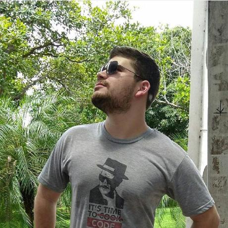

# gRPC

## Objetivo

Neste projeto foi criada uma conexão entre o cliente e server como um serviço de restaurante através do gRPC.

## Metas

- [x] Listar o cardapio de lanches
- [x] Cadastrar um novo item no cardápio
- [x] Excluir um item do cardápio
- [x] Montar pedido

## Integrantes

Rodrigo Cardoso | Francisco Peres
--------------- | ----------------
 | 
